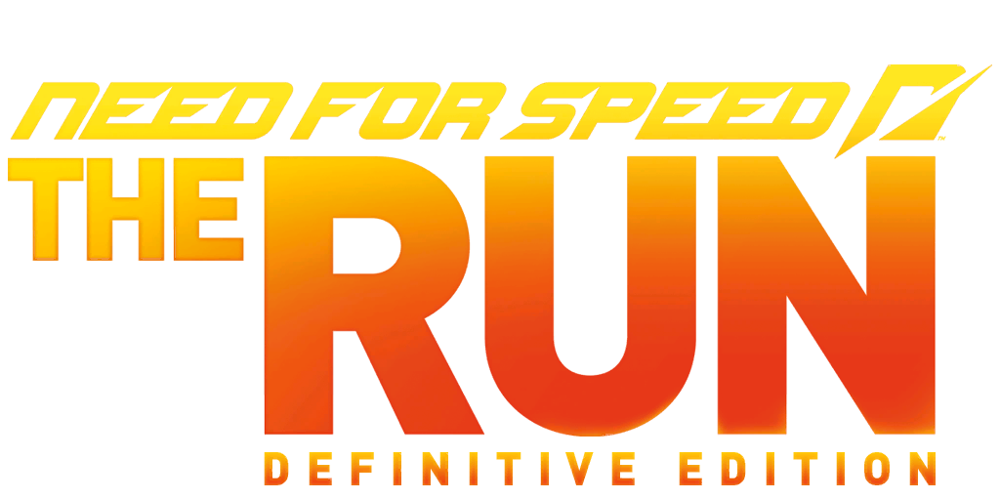

<p align="center">
  
</p>

# NFS The Run Definitive Edition

An ASI plugin for **Need for Speed: The Run** (PC, v1.1.0.0) that unlocks the
framerate and repairs the things that unlocking it breaks.

The Run shipped locked to 30 FPS. The usual way to unlock it raises the physics
simulation rate along with the framerate, and Frostbite 2 does not take that
well: the engine note stops following the RPM, tyre spray flies off sideways,
and the quick-time button prompts expire before you can react. This mod unlocks
the framerate and fixes each of those separately, so the game still behaves the
way it was tuned to at 30.

It also exposes engine settings the game never put in its menus, including field
of view and shadow map resolution.

Runs alongside [ThirteenAG's FusionFix](https://github.com/ThirteenAG/WidescreenFixesPack),
which handles intro skipping, windowed mode and unlocks. This mod deliberately
does not duplicate any of that.

---

## What it fixes

**Engine audio above 30 FPS.** The synth glides from the old pitch to a new one
over roughly 33 ms and restarts that glide every time the requested pitch
changes. A glide that has just restarted has not moved yet, so past 30 FPS the
pitch changes arrive faster than the glide can travel and the pitch never leaves
the 1000 Hz it starts at. Logging the synth confirmed it: at 144 FPS the
requested pitch tracked the RPM perfectly while the actual pitch sat frozen.
The fix stops the glide re-arming, so pitch follows RPM directly.

**Tyre spray, drift smoke and dirt dust.** These effects have each particle
inherit part of the wheel's velocity. Above 30 FPS that inherited velocity comes
out far too large, so the spray spawns in the right place and then streaks away
sideways or straight up. It repeats at the same point on a track because the
direction comes from the wheel's motion and the ground there. The fix scales the
inherited velocity back down and touches nothing else.

**Quick-time event prompts.** The QTE countdown assumes a 30 FPS frame time, so
at 144 FPS the prompts expire almost five times too quickly. The mod drops the
simulation back to 30 whenever you do not have control of the car, which is
exactly when QTEs and scripted cutscenes play, and restores your target
framerate the moment you are driving again.

**Minimap rendering.** On some events the minimap comes up glitchy, invisible,
or missing road segments. Clearing the render target each frame fixes it.

## What it adds

All off by default unless noted.

| Setting | Notes |
|---|---|
| Field of view | The game runs 48, which is why the chase camera sits on the bumper. Defaults to 60, and only while driving so the garage is untouched. |
| Shadow map resolution | Stock is 512. 1024 and 2048 are visibly sharper. |
| Motion blur, MSAA, shadow distance and slices | Read once when a level loads, so they apply from the next event. |
| Viewport shift and camera roll | Raises or tilts the view. Conflicts with FusionFix's camera; see the INI. |
| Traffic density, max density and car count | |
| Driving assists | Turns off the racing-line and drift assists that steer for you. Five patches for the basic set, thirteen for all of them. |
| Checkpoint timer, out-of-bounds reset, wrong-way respawn | For free roam and experimenting. |
| QA debug menu and photo mode | On by default. |

## Install

1. Install an ASI loader if you do not have one. FusionFix ships with one.
2. Copy `NFSTR_DefinitiveEdition.asi` and `NFSTR_DefinitiveEdition.ini` into the
   game's `plugins` folder, next to the other ASI files.
3. Set `FPSLimit` in the INI. It defaults to 60.

Every setting is documented in the INI itself, including what each one costs.

## Build

MinGW-w64 targeting 32-bit, C++17:

```
build.bat
```

or with CMake:

```
cmake -B build -A Win32
cmake --build build --config Release
```

The output is `NFSTR_DefinitiveEdition.asi`. There is no dependency beyond the
Win32 API; the hooks are hand-written x86 assembly.

## How the patches work

Every patch checks the bytes it is about to overwrite against a known signature
first, and logs and skips if they do not match. A wrong address produces a line
in the log instead of a crash. Addresses are resolved relative to the module
base, so ASLR and relocation do not break them.

The mod also chains onto FusionFix rather than fighting it. Both hook the same
vehicle-control check; this one detects the existing hook, reads its jump target
and calls into it, so both run.

Turn on `DebugLog` and read `NFSTR_DefinitiveEdition.log` if something looks
wrong. It records every patch, every address, and the bytes that were there.

## Known limitations

`FixSimTickWhenDriving` runs the whole simulation at a fixed rate. It fixes
collision detection and prop motion, but the simulation rate also drives the
camera springs and input polling, so the chase camera goes rigid and inputs can
drop. It ships off and is documented as a trade-off rather than a fix.

The exhaust backfire flame does not draw while that setting is on. Burst
particles are given a lifetime counted in simulation frames but aged once per
rendered frame, so at 144 FPS against a 30 Hz simulation they expire before they
are ever drawn. It only happens when the two rates differ; at `FPSLimit = 30`
the flame is back. The particle ageing code is not symbolised and the reflection
strings for it have no cross-references, so there is no anchor to work from yet.

`ViewDistance`, `DrawFps` and `ForceBlurAmount` exist in the engine settings but
do nothing in the retail build. They were tested and left out.

## Documentation

`docs/RESEARCH.md` is the reverse engineering log: verified addresses, struct
layouts, the Frostbite settings system and how to reach it, what each fix
actually does, and the things that were tried and did not work.

`docs/SETTINGS_FIELDS.md` lists field names, offsets and types for sixteen
Frostbite settings classes, extracted from the game's own reflection data rather
than guessed. `docs/dump_fields.py` is the extractor, and it works on any class
in the binary.

`research/` holds code that is not in the build: crash workarounds from the
community Cheat Engine tables that turned out to scatter race AI, and an
unfinished unreleased-events feature.

## Credits

Brawltendo, for the IDA database and for the
[NFS Rivals framerate unlocker](https://github.com/Brawltendo/NFS-Rivals-Framerate-Unlocker),
which showed how the same class of bug was solved in a later Frostbite game.

_mRally2, for The Run Master Table and the research behind it. The traffic,
assist and camera addresses came from that work.

ThirteenAG, for FusionFix and the ASI loader.

## Compatibility

Built and tested against Need for Speed: The Run v1.1.0.0 on Windows. The
signature checks mean other versions will refuse to patch rather than corrupt
themselves, but nothing else is tested.
